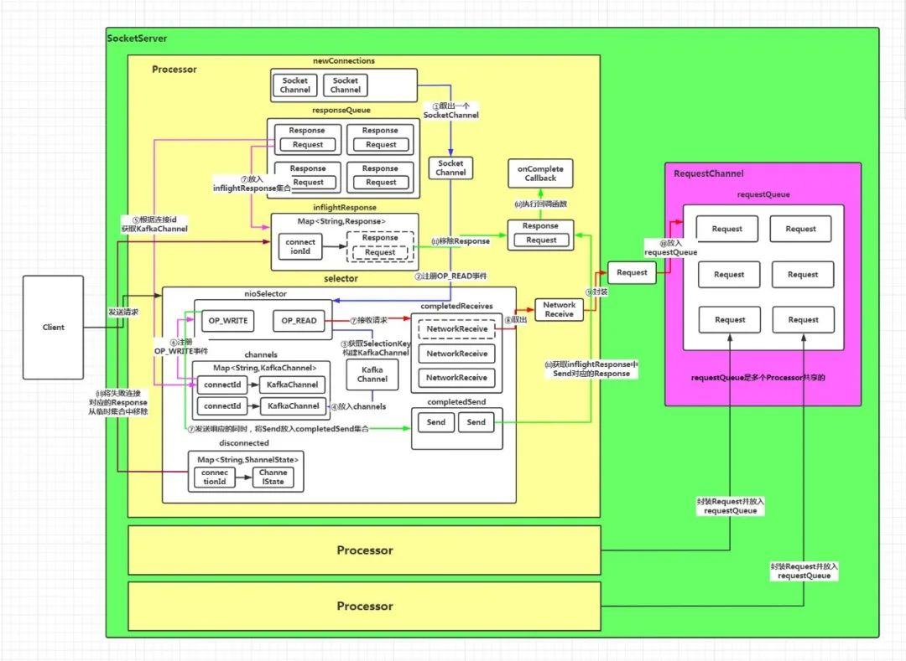

### 1. 前言

kafka高性能、高吞吐量的背后和broker端优秀的网络模块设计密不可分，整体而言kafka采用java原生的nio来处理来自producer，consumer以及其他broker的请求，本文就从kafka的启动函数main开始，剖析一下kafka network模块的架构。

### 2. 整体架构

kafka网络模块的架构图如下:




kafka network模块两个最重要的构成是Server Socket和KafkaRequestHandler

1. Server Socket

Server Socket实现了reactor线程模型，由一个Adaptor线程来不断的轮训注册在ServerSocketChannel上的就绪连接事件(OP_ACCEPT)，而一个Adaptor线程有对应processors线程池，Adaptor线程轮训出的就绪事件，会按照一定的规则从线程池里选择出一个processor线程去处理，而processor线程负责与client建立connection，并将返回的客户端socket channel加入到Request Queue队列。

也就是说，Server Socket并没有对请求做真实的业务处理，它的作用仅仅是轮训事件然后建立连接，最后作为生产者把socket channel扔到了Request Queue。

2. KafkaRequestHandlerPool

   	与Server Socket相反，KafkaRequestHandlerPool则是真实对请求做业务处理的模块。KafkaRequestHandlerPool里有多个KafkaRequestHandler，而KafkaRequestHandler会从Request Queue里消费数据，然后为消费的数据分配一个io线程，去处理。

### 3. 组件

#### 3.1. Acceptor

​	  acceptor是一个单独的线程，它的职责是用nio的selector不断的轮训服务端channel上就绪连接(OP_ACCEPT)事件，并为这些就绪的连接事件分配一个processor去处理。

​    acceptor的主要核心内容在run方法:

```scala
def run(): Unit = {
    serverChannel.register(nioSelector, SelectionKey.OP_ACCEPT)
    startupComplete()
    try {
      var currentProcessorIndex = 0
      while (isRunning) {
        try {
          val ready = nioSelector.select(500)
          if (ready > 0) {
            val keys = nioSelector.selectedKeys()
            val iter = keys.iterator()
            while (iter.hasNext && isRunning) {
              try {
                val key = iter.next
                iter.remove()
                if (key.isAcceptable) {
                  accept(key).foreach { socketChannel =>
                    var retriesLeft = synchronized(processors.length)
                    var processor: Processor = null
                    do {
                      retriesLeft -= 1
                      processor = synchronized {
                          currentProcessorIndex = currentProcessorIndex % processors.length
                          processors(currentProcessorIndex)
                      }
                      currentProcessorIndex += 1
                    } while (!assignNewConnection(socketChannel, processor, retriesLeft == 0))
                  }
                } 
              } catch {
                //...
              }
            }
          }
        }
    } 
```


要看懂这段代码，需要具备一定的nio知识。

首先第一段:

```scala
serverChannel.register(nioSelector, SelectionKey.OP_ACCEPT)
startupComplete()
```

serverChannel是acceptor创建的一个服务端channel，封装了一个服务端socket，nioSelector是一个nio的事件选择器，它会对注册在它上面的channel不断的轮训出想要的类型的就绪事件，因此这行代码的含义就是将服务端channel注册到nioSelector，注册的类型是OP_ACCEPT，只关心连接事件。

startupComplete则是标志一下启动成功了，修改启动和关闭两个CountDownLatch。

重点来了，下面这个while循环，就是Acceptor轮训的关键:

isRunning这个变量是Broker是否还在运行的标志，除非Broker挂了，否则一直是true。

随后：

```scala
val ready = nioSelector.select(500)
```

这个nio的一次阻塞式的select，意思就是nioSelector持续轮训500ms，并返回就绪事件的数量。

如果就绪事件数量大于0，则查询出就绪事件(SelectedKey)集合，并且用一个while循环去遍历，对于每个SelectedKey的处理：

1. 创建连接

   ```scala
   val socketChannel = serverSocketChannel.accept()
   ```

2. 分配processor

   ```scala
   var processor: Processor = null
   do {
     retriesLeft -= 1
     processor = synchronized {
     currentProcessorIndex = currentProcessorIndex % processors.length
     processors(currentProcessorIndex)
     }
     currentProcessorIndex += 1
   } while (!assignNewConnection(socketChannel, processor, retriesLeft == 0))
   ```

   对processors数组长度取模，取出一个processor，并在assignNewConnection方法中判断这个processor是否可用，一直循环直到找到可用的processor，并将selectedKey所对应的客户端channel作为参数传入，assignNewConnection是这么做的:

   ```scala
   def accept(socketChannel: SocketChannel,
                mayBlock: Boolean,
                acceptorIdlePercentMeter: com.yammer.metrics.core.Meter): Boolean = {
       val accepted = {
         if (newConnections.offer(socketChannel))
           true
         else if (mayBlock) {
           val startNs = time.nanoseconds
           newConnections.put(socketChannel)
           acceptorIdlePercentMeter.mark(time.nanoseconds() - startNs)
           true
         } else
           false
       }
       if (accepted)
         wakeup()
       accepted
     }
   ```

   首先尝试将刚才传入的socketChannel加到阻塞队列newConnections，如果队列已满则根据mayBlock决定是否阻塞一段时间再插入。总而言之:

   > assignNewConnection这个方法就是将就绪事件SelectKey对应的客户端channel(socket channel)加入到newConnections这个阻塞队列以供后续流程使用。

acceptor这个组件做的事情很简单，就是找出就绪事件，然后为每个事件分配一个processor线程处理，并将socket channel加入到。 	 newConnections这个阻塞队列。

#### 3.2 Processor

processor是处理请求的线程，这个请求可能来自acceptor轮训出的request，也可能来自处理完事件的response，processor有三个重要的数据结构:

```scala
  private val newConnections = new ArrayBlockingQueue[SocketChannel](connectionQueueSize)
  private val inflightResponses = mutable.Map[String, RequestChannel.Response]()
  private val responseQueue = new LinkedBlockingDeque[RequestChannel.Response]()
```

newConnections上面已经提到了，responseQueue是每个processor独有的一个响应队列，KafkaRequestHandler处理完请求以后会将处理结果放到这个队列返回给客户端。而inflightResponses也是用来存response的，它存在的意义是，有些response事件返回给客户端以后，还需要处理一些broker的回调，因此将这些reponse临时存在inflightResponses里。

同样，下面来看processor线程的run方法:

```scala
override def run(): Unit = {
    startupComplete()
    try {
      while (isRunning) {
        try {
          configureNewConnections()
          processNewResponses()
          poll()
          processCompletedReceives()
          processCompletedSends()
          processDisconnected()
          closeExcessConnections()
        } catch {
          case e: Throwable => processException("Processor got uncaught exception.", e)
        }
      }
    }
  }
```

processor的run方法同样启动了一个死循环，只要kafka broker在运行就不会停止。循环里调用了七个方法，每个方法做单独的业务处理，代码层次非常清晰，这里我们只讨论处理请求的方法而不讨论处理响应的方法。

1. configureNewConnections

   ```scala
   while (connectionsProcessed < connectionQueueSize && !newConnections.isEmpty) {
   	val channel = newConnections.poll()
   	selector.register(connectionId(channel.socket), channel)
     connectionsProcessed += 1
   }
   ```

   configureNewConnections方法核心逻辑就是这几行代码，可以很清晰的看出，所做的工作就是先从newConnections请求队列里取出一个acceptor放进去的socket channel，然后将socket channel注册到一个selector。需要注意的是，这个selector是kafka对nio selector对的一层封装，而这个register方法:

   ```scala
   public void register(String id, SocketChannel socketChannel) throws IOException {
     ensureNotRegistered(id);
     registerChannel(id, socketChannel, SelectionKey.OP_READ);
     this.sensors.connectionCreated.record();
   }
   ```

   再往下看这个registerChannel方法:

   ```scala
   protected SelectionKey registerChannel(String id, SocketChannel socketChannel, int interestedOps) {
     SelectionKey key = socketChannel.register(nioSelector, interestedOps);
     KafkaChannel channel = buildAndAttachKafkaChannel(socketChannel, id, key);
     this.channels.put(id, channel);
     if (idleExpiryManager != null)
     idleExpiryManager.update(channel.id(), time.nanoseconds());
     return key;
   }
   ```

   这个方法做了非常重要的处理。首先和之前acceptor将服务端channel注册到nioSelector上一样，这里将newConnections队列里面取出来的客户端socketChannel也注册到了nioSelector上，注册的事件类型是OP_READ。

   此外通过buildAndAttachKafkaChannel方法，将这个socketChannel封装成了一个KafkaChannel，并将这个KafkaChannel添加到channels里。

   ```scala
   private final Map<String, KafkaChannel> channels;
   ```

   channels是Selector的一个变量，它是一个Map，key是根据socketChannel编号，value是封装的KafkaChannel，processor线程关闭的时候会遍历这个channels，将所有channel关闭。

   

2. poll

   看过很多关于kafka network的博客，讲到这个poll方法的时候，一般都是这么介绍的:

   > poll方法是真正进行nio poll的地方

​	   但是有真正把poll方法剖开层层分析的文章少之又少，因为poll方法特别复杂，所以看起来都很吃力，这里我把poll方法个人觉得几个	  重要的地方分析一下:

- selector poll出所有就绪事件

  ```scala
  Set<SelectionKey> readyKeys = this.nioSelector.selectedKeys();
  ```

  这个nio的处理，将所有就绪事件封装成SelectionKey放到一个set里

- processSelectionKeys

  ```scala
  for (SelectionKey key : selectionKeys) {
  	KafkaChannel channel = channel(key);
  	addToStagedReceives(channel, receive);
  }
  ```

  ```scala
  Map<KafkaChannel, Deque<NetworkReceive>> stagedReceives;
  ```
  
  这里省略了非常多的代码，process的核心就是将key封装成kafkaChannel，然后加入到stagedReceives中。
  
  最后又stagedReceives中的channel加到completedReceives中
  
  ```
  private void addToCompletedReceives(KafkaChannel channel, Deque<NetworkReceive> stagedDeque) {
    NetworkReceive networkReceive = stagedDeque.poll();
    this.completedReceives.add(networkReceive);
    this.sensors.recordBytesReceived(channel.id(), networkReceive.size());
  }
  ```


​       至于为什么不直接将channel加到completeReceive中，是因为中间有许多鉴权处理的过程，而这个NetworkReceive对象，则是包含      	   了请求具体的io信息。

3. processCompleteReceives

   第二步已经将所有事件封装成NetworkReceive并添加到了completedReceives中，第三步则是将这些数据发送出去，通过processCompleteReceives方法，而这个方法的核心在于下面这几句:

   ```scala
   val connectionId = receive.source
   val context = new RequestContext(header, connectionId, channel.socketAddress,
   channel.principal, listenerName, securityProtocol)
   val req = new RequestChannel.Request(processor = id, context = context,
   startTimeNanos = nowNanos, memoryPool, receive.payload, requestChannel.metrics)
   requestChannel.sendRequest(req)
   ```

   可以看出，就是将receive对象封装成一个Request对象，然后加入到SocketChannel的RequestChannel队列中，这个RequestChannel是所有processor线程公用的。

   

到此为止，processor的逻辑全部梳理完成了，总结一下就是:

1. 处理acceptor添加到newConnections队列中的socketChannel，将socketChannel注册到nioSelector,并封装成KafkaChannel添加到channels这个Map中
2. 执行poll，poll出socketChannel中所有就绪事件，经过大量处理封装成NetworkReceive对象添加到CompletedReceives数组
3. 将CompletedReceives数组中的元素封装成Request对象，添加到SocketServer的RequestChannel中。


#### 3.3 KafkaRequestHandler

​	KafkaRequestHandler是有一个单独的组件，它和SocketServer的processor线程组构成了一个生产者消费者模型，而中间的存储介质则是SocketServet的RequestChannel队列。

​    KafkaRequestHandler是实际对请求做io业务处理的线程，由于processor线程中已经对请求做了非常好的封装，所以KafkaRequestHandler的逻辑非常的简单，来看看它的run方法：

```scala
def run(): Unit = {
    while (!stopped) {
      val startSelectTime = time.nanoseconds

      val req = requestChannel.receiveRequest(300)
      val endTime = time.nanoseconds
      val idleTime = endTime - startSelectTime
      aggregateIdleMeter.mark(idleTime / totalHandlerThreads.get)

      req match {
        case RequestChannel.ShutdownRequest =>
          shutdownComplete.countDown()
          return

        case request: RequestChannel.Request =>
          try {
            request.requestDequeueTimeNanos = endTime
            apis.handle(request)
          } catch {
            case e: Throwable => error("Exception when handling request", e)
          } 
    shutdownComplete.countDown()
  }
```


首先从RequestChannel中获取一个request，然后调用apis.handle处理这个request，而这个apis.handle，则称得上是Kafka最重要的一个源码入口了:

```scala
def handle(request: RequestChannel.Request): Unit = {
    try {
      request.header.apiKey match {
        case ApiKeys.PRODUCE => handleProduceRequest(request)
        case ApiKeys.FETCH => handleFetchRequest(request)
        case ApiKeys.LIST_OFFSETS => handleListOffsetRequest(request)
        case ApiKeys.METADATA => handleTopicMetadataRequest(request)
        case ApiKeys.LEADER_AND_ISR => handleLeaderAndIsrRequest(request)
        case ApiKeys.STOP_REPLICA => handleStopReplicaRequest(request)
        case ApiKeys.UPDATE_METADATA => handleUpdateMetadataRequest(request)
        case ApiKeys.CONTROLLED_SHUTDOWN => handleControlledShutdownRequest(request)
        case ApiKeys.OFFSET_COMMIT => handleOffsetCommitRequest(request)
        case ApiKeys.OFFSET_FETCH => handleOffsetFetchRequest(request)
        case ApiKeys.FIND_COORDINATOR => handleFindCoordinatorRequest(request)
        case ApiKeys.JOIN_GROUP => handleJoinGroupRequest(request)
        case ApiKeys.HEARTBEAT => handleHeartbeatRequest(request)
        case ApiKeys.LEAVE_GROUP => handleLeaveGroupRequest(request)
        case ApiKeys.SYNC_GROUP => handleSyncGroupRequest(request)
        case ApiKeys.DESCRIBE_GROUPS => handleDescribeGroupRequest(request)
        case ApiKeys.LIST_GROUPS => handleListGroupsRequest(request)
        case ApiKeys.SASL_HANDSHAKE => handleSaslHandshakeRequest(request)
        case ApiKeys.API_VERSIONS => handleApiVersionsRequest(request)
        case ApiKeys.CREATE_TOPICS => handleCreateTopicsRequest(request)
        case ApiKeys.DELETE_TOPICS => handleDeleteTopicsRequest(request)
        case ApiKeys.DELETE_RECORDS => handleDeleteRecordsRequest(request)
        case ApiKeys.INIT_PRODUCER_ID => handleInitProducerIdRequest(request)
        case ApiKeys.OFFSET_FOR_LEADER_EPOCH => handleOffsetForLeaderEpochRequest(request)
        case ApiKeys.ADD_PARTITIONS_TO_TXN => handleAddPartitionToTxnRequest(request)
        case ApiKeys.ADD_OFFSETS_TO_TXN => handleAddOffsetsToTxnRequest(request)
        case ApiKeys.END_TXN => handleEndTxnRequest(request)
        case ApiKeys.WRITE_TXN_MARKERS => handleWriteTxnMarkersRequest(request)
        case ApiKeys.TXN_OFFSET_COMMIT => handleTxnOffsetCommitRequest(request)
        case ApiKeys.DESCRIBE_ACLS => handleDescribeAcls(request)
        case ApiKeys.CREATE_ACLS => handleCreateAcls(request)
        case ApiKeys.DELETE_ACLS => handleDeleteAcls(request)
        case ApiKeys.ALTER_CONFIGS => handleAlterConfigsRequest(request)
        case ApiKeys.DESCRIBE_CONFIGS => handleDescribeConfigsRequest(request)
        case ApiKeys.ALTER_REPLICA_LOG_DIRS => handleAlterReplicaLogDirsRequest(request)
        case ApiKeys.DESCRIBE_LOG_DIRS => handleDescribeLogDirsRequest(request)
        case ApiKeys.SASL_AUTHENTICATE => handleSaslAuthenticateRequest(request)
        case ApiKeys.CREATE_PARTITIONS => handleCreatePartitionsRequest(request)
        case ApiKeys.CREATE_DELEGATION_TOKEN => handleCreateTokenRequest(request)
        case ApiKeys.RENEW_DELEGATION_TOKEN => handleRenewTokenRequest(request)
        case ApiKeys.EXPIRE_DELEGATION_TOKEN => handleExpireTokenRequest(request)
        case ApiKeys.DESCRIBE_DELEGATION_TOKEN => handleDescribeTokensRequest(request)
        case ApiKeys.DELETE_GROUPS => handleDeleteGroupsRequest(request)
        case ApiKeys.ELECT_LEADERS => handleElectReplicaLeader(request)
        case ApiKeys.INCREMENTAL_ALTER_CONFIGS => handleIncrementalAlterConfigsRequest(request)
        case ApiKeys.ALTER_PARTITION_REASSIGNMENTS => handleAlterPartitionReassignmentsRequest(request)
        case ApiKeys.LIST_PARTITION_REASSIGNMENTS => handleListPartitionReassignmentsRequest(request)
        case ApiKeys.OFFSET_DELETE => handleOffsetDeleteRequest(request)
      }
    } catch {
      case e: FatalExitError => throw e
      case e: Throwable => handleError(request, e)
    } finally {
      request.apiLocalCompleteTimeNanos = time.nanoseconds
    }
  }
```

第一次追踪源码追到这里的时候，感觉就像探寻宝藏，经过层层阻挠，终于看到了金碧辉煌的大门一样。所有Kafka的请求，都由这个入口进入处理，如果能掌握这个方法涉及到的所有方法，那可真算是Kafka大师了。


具体的io业务处理这里就不展开了，总而言之kafka的网络模块非常负责，但是逻辑链路也很清晰，生产者消费者的使用算是被kakfa运用的淋漓尽致，也可以看出，kakfa之所以有那么高的吞吐量，除去针对操作系统底层的优化不谈，它的架构设计也是重要原因之一。
