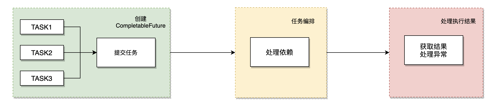
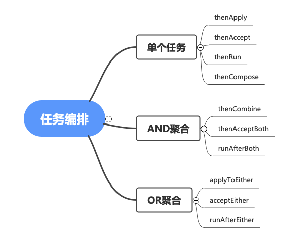
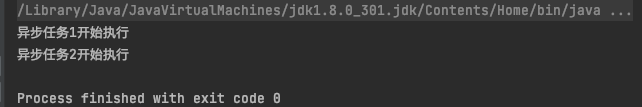
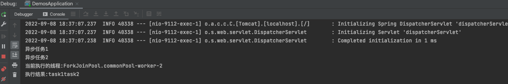

---

layout: post
title: Java并发编程——CompletableFuture
subtitle:
categories: java
tags: [java]
---


### 1. Future

有些业务场景，我们的接口需要做多个会阻塞主线程的子任务，比如数据库查询，rpc调用，文件的io等等，我们可以以多线程的方式异步执行这些任务，加快接口的响应速度。java提供了多种多线程的实现方式，但是无论是Thread还是Runnable，都无法处理任务之间有依赖关系的场景。


举个例子:


用户下单购买一件商品，后台需要判断用户余额是否充足，而用户的余额由充值的付费余额 + 系统下发的免费余额，这两个额度的查询分别由两个微服务接口提供。所以整个任务需要做三件事

- 调用付费余额查询服务，查询付费金额
- 调用免费余额查询服务，查询免费金额
- 计算商品打折后的价格，判断用户余额是否充足


下面用几种方式来实现这个需求，通过对比


1. 串行


串行执行是最简单的方式，但是性能最差，因为step1和step2其实可以并行执行，等这两步都执行完了，再执行step3。


2. Future + CountDownLatch


获取Future的执行结果需要通过get()方法，这个方法会阻塞当前线程，效率比较低。


3. ListenableFutureTask

我们可以通过一些第三方对Future的拓展来实现，如Google Guava的ListenableFutureTask:


这种方式可以不用显示的调用Future的get方法来阻塞式的获取任务结果，而是任务执行完成以后通过回调函数自动触发。但与此同时，如果任务依赖很复杂，将会需要写很多的回调函数，造成臭名昭著的"回调地狱"


### 2. CompletableFuture

前面对比了几种实现任务编排的方式，但功能上都有很明显的缺陷和不足，并且都不够优雅。JDK8为提供了一款强大的异步任务的编排工具CompletableFuture,它让异步任务的处理变得十分简单和优雅，上面的例子，用CompletableFuture可以这样实现:


是不是非常简单和优雅?


CompletableFuture实现了Future和CompletionStage两个接口，它既延续了Future的特性，也具备了CompletionStage里所有的特性。下面我们就主要的方法出发，看看CompletableFuture应该如何使用。


CompletableFuture里大量使用了java的函数式编程接口，为了能更容易理解，所以在介绍CompletableFuture的特性之前，先大概的介绍一下java的函数式接口。


在jdk的java.util.function包里，共有四个类型的函数式接口，分别是:Function,Predicate,Supplier,Consumer,用一个表格来对比这四种接口的差异:


| 类型         | 方式   | 方法              | 参数 | 返回值          |
| ------------ | ------ | ----------------- | ---- | --------------- |
| Function     | 函数式 | R apply(T t)      | 有   | 有              |
| Predicticate | 断言式 | boolean test(T t) | 有   | 有，返回boolean |
| Supplier     | 供给式 | T get()           | 无   | 有              |
| Consumer     | 消费式 | void accept(T t)  | 有   | 无              |


CompletableFuture的完整处理可以分为三个步骤: 创建CompletableFuture、任务编排、处理执行结果



下面根据这三个步骤分类，详细介绍CompletableFuture的用法。


#### 2.1 创建CompletableFuture

- completedFuture()

  通过completedFuture方法可以创建一个状态为已完成的CompletableFuture

  ```java
  CompletableFuture<String> cf = CompletableFuture.completedFuture("已完成");
  ```

- supplyAsync()

  通过supplyAsync方法可以提交一个异步任务并创建一个CompletableFuture, 这个方法有两个重载实现，区别在于是否传入自定义线程池参数：

  ```java
  public static <U> CompletableFuture<U> supplyAsync(Supplier<U> supplier, Executor executor);
  public static <U> CompletableFuture<U> supplyAsync(Supplier<U> supplier);
  ```

  如果未传入executor参数，则使用默认的ForkJoinExecutor，这个线程池是公用的，建议使用自定义线程池。

  supplyAsync方法接收一个供给式函数接口Supplier,因此它不需要传入参数，可以获取任务的返回值:

  ```java
  public static void main(String[] args) {
    CompletableFuture<String> cf1 = CompletableFuture.supplyAsync(() -> {
      System.out.println("异步任务1");
      return "task1";
    });
  
    CompletableFuture<String> cf2 = CompletableFuture.supplyAsync(() -> {
      System.out.println("异步任务2");
      return "task2";
    }, Executors.newFixedThreadPool(10));
  
  }
  ```

- runAsync()

  通过runAsync方法也可以提交一个异步任务并创建一个CompletableFuture：

  ```java
  public static CompletableFuture<Void> runAsync(Runnable runnable);
  ```

  和supplyAsync的差异在于，runAsync传入的是一个Runnable任务，而Runnable是不需要参数且也没有返回值的，因此通过runAsync创建的CompletableFuture是无法获得任务执行的结果的:

  ```java
  CompletableFuture<Void> cf= CompletableFuture.runAsync(() -> System.out.println("runSync"));
  ```

- allOf()

  allOf方法可以将多个CompletableFuture合并创建一个新的CompletableFuture

  ```java
  public static CompletableFuture<Void> allOf(CompletableFuture<?>... cfs);
  ```

  并且只有等所有合并的CompletableFuture都执行完成了，才会执行后续的操作：

  ```java
  CompletableFuture<String> cf1 = CompletableFuture.supplyAsync(() -> {
    sleep(1);
    System.out.println("异步任务1");
    return "task1";
  });
  
  CompletableFuture<String> cf2 = CompletableFuture.supplyAsync(() -> {
    sleep(2);
    System.out.println("异步任务2");
    return "task2";
  });
  
  CompletableFuture.allOf(cf1, cf2).thenAccept(s -> {
    System.out.println("任务全部执行完成");
  }).join();
  ```

- anyOf()

  与allOf不同，anyOf方法是多个任务中有一个任务执行完成就返回一个新的CompletableFuture

  ```java
  public static CompletableFuture<Object> anyOf(CompletableFuture<?>... cfs);
  ```

  示例:

  ```java
  CompletableFuture<String> cf1 = CompletableFuture.supplyAsync(() -> {
      sleep(1);
      System.out.println("异步任务1");
      return "task1";
  });
  
  CompletableFuture<String> cf2 = CompletableFuture.supplyAsync(() -> {
      sleep(2);
      System.out.println("异步任务2");
      return "task2";
  });
  
  CompletableFuture.anyOf(cf1, cf2).thenAccept(s -> {
      System.out.println("有一个任务执行完成");
  }).join();
  ```

​	   由于cf1会先与cf2执行完成，所以这段代码会打印"task1"。

#### 2.2 任务编排

很多情况下，多个CompletableFuture之间会有着依赖关系，如何优雅的处理不同任务之间复杂的依赖关系，是CompletableFuture的核心。CompletableFuture提供了很多用于任务编排的方法。

​	  

				

这里主要介绍这三个分类的十个方法，这十个方法都是同步方法，每个方法都有与之对应的以Async结尾的异步方法。并且每个分类的各个方法作用其实都是类似的，需要在于传入的参数类型，有的是函数式参数，而有的是Runnable，可以根据处理依赖时不同的需求来选择相应的方法。


##### 2.2.1 单个任务

- thenApply()

  ```java
  public <U> CompletableFuture<U> thenApply(Function<? super T,? extends U> fn)
  ```

  thenApply传入的是Function类型参数，根据上面介绍过的java函数式参数的性质，Function是有入参数和返回值的，因此thenApply可以这样用：

  ```java
  CompletableFuture<String> cf1 = CompletableFuture.supplyAsync(() -> {
      sleep(1);
      System.out.println("异步任务1");
      return "task1";
  });
  
  CompletableFuture<String> result = cf1.thenApply(p -> {
      System.out.println("任务1的返回结果:" + p);
      return p;
  });
  ```

- thenAccept()

  ```java
  public CompletableFuture<Void> thenAccept(Consumer<? super T> action);
  ```

  Comsumer参数是有入参但是没有返回结果的:

  ```java
  cf1.thenAccept(p -> {
      System.out.println("处理结果:" + p);
  });
  ```

- thenRun()

  ```java
  public CompletableFuture<Void> thenRun(Runnable action);
  ```

  thenRun传入的是Runnable类型，因此这个方法没有入参也没有返回值，适合处理不需要关心任务的处理结果的情况:

  ```java
  cf1.thenRun(() -> {
      System.out.println("任务1完成后处理");
  });
  ```

  

##### 2.1.3 AND依赖

我们时常遇到这种场景，有两个task，需要等两个任务都完成以后，才做后续的处理，如把这两个task的结果合并等等，CompletableFuture提供了一些处理类似AND依赖的方法，很方便的处理这些场景。

- thenCombine

  ```java
  public <U,V> CompletableFuture<V> thenCombine(
          CompletionStage<? extends U> other,
          BiFunction<? super T,? super U,? extends V> fn);
  ```

  thenCombine接收两个参数，一个是另外一个CompletableFuture,一个是BiFunction,这个BiFunction传两个参数，分别是两个合并的CompletableFuture的执行结果:

  ```java
  //两个任务都完成以后，将两个任务合并
  CompletableFuture<String> combineResult = cf1.thenCombine(cf2, (r1, r2) -> r1 + r2);
  ```

- thenAcceptBoth

  前面介绍了thenAccept()方法，其实到这里我们应该知道了CompletableFuture类对于不同功能的方法分类，同一类的方法，不同的方法实现，只是具体根据需不需要传入参数，需不需要返回结果来实现的，根据thenAccept()方法同理可知thenAcceptBoth()方法，传入的依旧会是Comsumer对象，这个方法作用是两个CompletableFuture执行完成以后，做后续的处理，且不返回合并的结果。

  ```java
  public <U> CompletableFuture<Void> thenAcceptBoth(
      CompletionStage<? extends U> other,
      BiConsumer<? super T, ? super U> action);
  ```

  ```java
  cf1.thenAcceptBoth(cf2, (r1, r2) -> System.out.println(r1 + r2)).join();
  ```

- runAfterBoth

  runAfterBoth传入的是一个Runnable对象，既不用传入两个CompletableFuture的执行结果，也不用返回后续执行的结果:

  ```java
  public CompletableFuture<Void> runAfterBoth(CompletionStage<?> other,Runnable action);
  ```

  ```java
  cf1.runAfterBoth(cf2, () -> System.out.println("两个任务执行完成"));
  ```

- allOf

  前面介绍的方法都是处理两个任务的AND依赖，如果有超过两个任务的AND操作，可以用allOf实现

  ```java
  public static CompletableFuture<Void> allOf(CompletableFuture<?>... cfs);
  ```

  allOf方法是CompletableFuture的static方法，可以传入多个CompletableFuture对象，只有所有传入的任务都执行完成，才会执行后续操作：

  ```java
  CompletableFuture.allOf(cf1, cf2, cf3).thenRun(() -> System.out.println("所有任务执行完毕"));
  ```

##### 2.1.4 OR依赖

AND依赖是两个任务都执行完后执行后续，而OR依赖则是两个任务任意一个执行完就执行后续。处理OR依赖的方法和AND依赖的非常类似,这里只做大致的介绍

- applyToEither

  ```java
  public <U> CompletableFuture<U> applyToEither(
          CompletionStage<? extends T> other, Function<? super T, U> fn);
  ```

  传入的Function参数只接收一个参数，这个参数是执行完成的那个CompletableFuture的执行结果。

  ```java
  cf1.applyToEither(cf2, r -> r);
  ```

- acceptEither

  ```java
  cf1.acceptEither(cf2, System.out::println);
  ```

- runAfterEither

  ```java
  cf1.runAfterEither(cf2, () -> System.out.println("有一个任务执行完成"));
  ```

- anyOf

  ```java
  CompletableFuture.anyOf(cf1, cf2, cf4).thenRun(() -> System.out.println("有一个任务执行完成"));
  ```

##### 2.1.5 获取处理结果

有时候经过一系列的任务编排以后，我们需要获取最终的任务合并结果。在FutureTask中，可以手动通过get()方法阻塞式的获取任务的执行结果，而CompletableFuture中，通过任务的编排，我们可以在所有任务都执行完毕以后再去获取最终的结果，因此可以不用阻塞的获取任务结果,CompletableFuture提供了get(),join(),getNow()等方法用于获取结果。

##### 2.1.6 异常处理

在FutureTask中，可以用onFailure回调函数来处理任务执行过程中出现异常的情况，CompletableFuture用一种更优雅无需回调的方式来处理异常:

```java
cf1.applyToEither(cf2, r -> r).exceptionally(ex -> {System.out.println(ex.getMessage()); return null;});
```

### 3. 任务由哪个线程执行？

要合理治理线程资源，最基本的前提条件就是要在写代码时，清楚地知道每一行代码都将执行在哪个线程上。下面我们看一下CompletableFuture的执行线程情况。


我在main方法中新建了两个task，并且需要将两个task做合并操作:

```java
public static void main(String[] args) throws ExecutionException, InterruptedException {
    CompletableFuture<String> cf1 = CompletableFuture.supplyAsync(() -> {
        System.out.println("异步任务1开始执行");
        sleep(1);
        return "task1";
    });

    CompletableFuture<String> cf2 = CompletableFuture.supplyAsync(() -> {
        System.out.println("异步任务2开始执行");  
        sleep(2);
        return "task2";
    });
    
    cf1.thenCombine(cf2, (r1, r2) -> {
        System.out.println("合并结果:" + (r1 + r2));
        return r1 + r2;
    });
}

public static void sleep(int seconds){
    try {
        Thread.sleep(seconds*1000);
    } catch (InterruptedException e) {
        e.printStackTrace();
    }
}
```

每个task都异步执行，分别打印一句话后睡眠1s和2s，两个task都执行完成以后执行合并操作，并打印合并的结果。


这是一段非常简单的CompletableFuture的运用，按照thenCombine的实现，正常控制台应该打印最终的合并结果，然后这段代码运行之后并没有打印合并结果



笔者最开始碰到这种情况时，百思不得其解，thenCombin不是同步的方法吗，两个task执行完毕以后，应该会打印合并结果。

此时关于为什么结果不打印，我有一个猜想:  thenCombine方法相对于主线程是异步执行的，main函数先退出了所以没有打印

为了验证这个问题，我启动了一个本地的服务Controller:


```java
		@GetMapping("/test")
    @ResponseBody
    public String getCombineInfo() {
        CompletableFuture<String> cf1 = CompletableFuture.supplyAsync(() -> {
            System.out.println("异步任务1");
            sleep(1);
            return "task1";
        });

        CompletableFuture<String> cf2 = CompletableFuture.supplyAsync(() -> {
            System.out.println("异步任务2");
            sleep(2);
            return "task2";
        });

        cf1.thenCombine(cf2, (r1, r2) -> {
            System.out.println("当前执行的线程:" + Thread.currentThread().getName());
            System.out.println("执行结果:" + (r1+r2));
            return r1 + r2;
        });

        return "complete";
    }
```

浏览器访问，控制台输出的结果:



可以看到thenCombine里的打印结果输出来了，并且是有ForkJoinPool里的线程执行的，验证了我们的猜想。


现在换个方式，我在thenCombine之前将主线程sleep 2s，确保thenCombine执行的时候两个task都已经执行完成,这个时候控制台输出的是:


可以看到，combine的结果是正常的，而执行combine的线程变成了一个http-nio线程，这其实是tomcat里的一个线程，也就是运行这个controller的主线程。


到这里我们可以得到第一个结论:

> CompletableFuture的同步方法，在执行之前如果这个CompletableFuture已经执行完成了，那这个同步方法会由主线程执行。


在实验1中，我们用了两个线程，最终执行Combine操作的是sleep 2s的task2，那我们是不是可以猜想，需要多个CompletableFuture执行完成的同步操作，如果执行之前所有CompletableFuture没有全部执行完成，最终的同步操作会由最后完成的那个task的线程执行。


为了验证这个猜想，我这里用三个CompletableFuture来操作:

```java
@GetMapping("/test")
@ResponseBody
public String getCombineInfo() {
    CompletableFuture<String> cf1 = CompletableFuture.supplyAsync(() -> {
        System.out.println("异步任务1");
        sleep(1);
        return "task1";
    });

    CompletableFuture<String> cf2 = CompletableFuture.supplyAsync(() -> {
        System.out.println("异步任务2");
        sleep(2);
        return "task2";
    });

    CompletableFuture<String> cf3 = CompletableFuture.supplyAsync(() -> {
        sleep(3);
        System.out.println("异步任务3");
        return "task3";
    });

    CompletableFuture.allOf(cf1, cf2, cf3).thenAccept(p -> {
        System.out.println(Thread.currentThread().getName() + "执行完成");
        System.out.println(cf1.join() + cf2.join() + cf3.join());
    });

    return "complete";
}
```

输出的结果:


结果符合我们的猜想，由于cf3是最后一个执行完的，所以最终的accept操作由cf3所在的线程执行。
