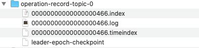

### 1. LogSegment

kafka中，broker需要对生产者的消息做持久化，将消息以文件的形式存储到服务器的磁盘上，当消费者来消费时，broker需要去磁盘读取文件，找到消息然后发送给消费者。Kafka对日志持久化做了精心的设计，通过分段的形式，将日志文件从一个大文件分割成一个个的LogSegment，日志的写入和读取都可以通过操作LogSegment来实现。

在kafka的log目录下，每个topic都有一个单独的文件夹，这些文件夹里面保存了日志文件，里面有三种类型的文件

1. .log文件，存储了真实的消息
2. .index文件，存储了消息的位移索引
3. .timeindex文件，存储了消息的时间戳索引

每个文件名20位长度，文件名是这个LogSegment最小的offset值，也就是baseOffset值。消费消息时，会根据消费的offset值决定去哪个LogSegment文件中检索。

磁盘的io是非常低效的，因此在消费者根据位移消费时，如果broker去顺序的遍历日志文件读取，那消费的效率将会非常低下，所以LogSegment为每个日志文件增加了一个位移索引文件，用跳表或者说稀疏索引来加快消息的检索。

用一张图来展示消息的检索过程:

例如某个消费者要从offset=100来消费消息，会首先读取索引，定位到小于100的最大值也就是offset=92，而对应的position(物理地址)=4176,随后会从日志文件中读取4176长度后，继续往下读取，直到读取到offset=100。

在源码中，kafka用ConcurrentSkipListMap跳表来组织索引。

### 2. 页缓存

在操作系统中，文件是以物理页的形式存储在磁盘上的，当一个进程去读取一个文件的内容时，也是按页读取，会读取页目录，然后找到页表，再通过页表将对应的物理页加载到内存中。而操作系统提供了页缓存来提高这个过程的效率。

1. 读取文件时，会首先读取页缓存，如果页缓存中已经存在要读取的页，则无需去磁盘读取，如果页缓存中不存在，则去读取磁盘，并且将物理页加入到页缓存
2. 写文件时，会将文件内容写到页缓存，并定期将页缓存的内容刷到磁盘中。

对kafka来说，日志文件的读写都是非常频繁的，如果将物理页都缓存到进程中，由于java对象本身有额外的开销，会导致占用的堆内存变大，gc的频率变得更加频繁，从而降低kafka的请求相应速度。

因此kafka中大量的使用页缓存来代替内存操作，日志的读写都基于页缓存，大大提高了kafka的吞吐率，与此同时也存在一个问题:kafka的副本会同步leader副本的数据，而某个时刻，页缓存的内容并没有同步到磁盘，此时leader宕机了，会从新选举出来一个leader，而此前页缓存的数据并没有同步到follower副本，新的leader副本就丢失了这部分数据。

考虑到这个问题，kafka提供了实时刷盘机制，可以立即将页缓存的内容同步到磁盘。

页缓存还存在另外一个问题，会直接影响kafka的性能: PageCache竞争

Linux运用LRU算法实现对页缓存的淘汰策略，页缓存的容量是有限的，Linux会将那些很久没有命中的页缓存淘汰掉。当一台机器存在多个Kafka consumer时，如果consumer的消费速度都很快，那producer写到页缓存的数据可以马上被consumer消费掉，不存在PageCache的竞争问题。

但是如果某些consumer消费存在很高的延时，它们来消费时，如果PageCache的空间不足，很可能他们要消费的数据页缓存已经被淘汰了，只能触发磁盘io去磁盘读取，随后Linux会将读取到的数据加到页缓存，由于LRU的机制，其他实时消费的页缓存会被淘汰，造成其他实时消费的consumer被迫去

### 4. 零拷贝

### 5. 二分法查找

